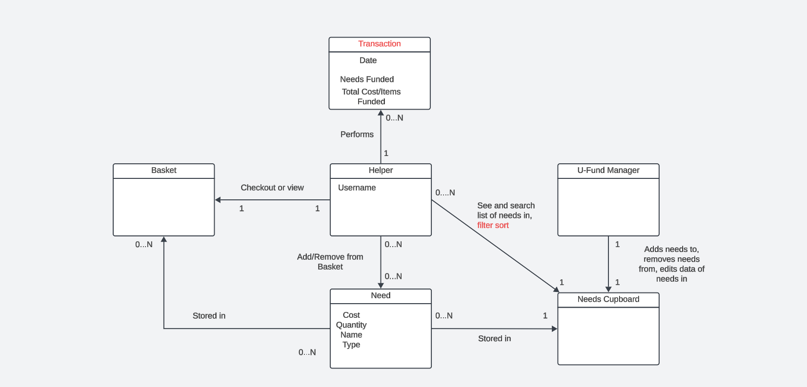
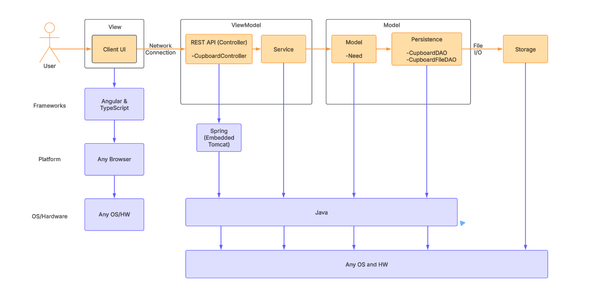
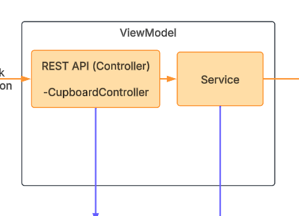
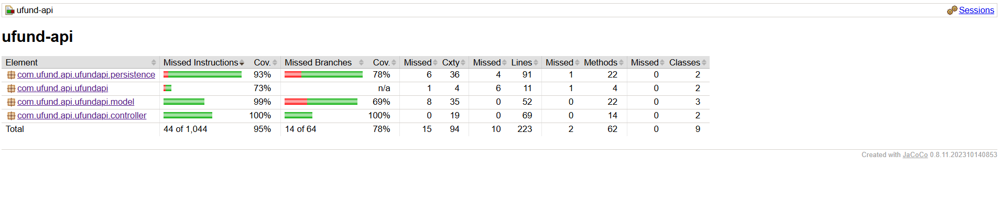

# PROJECT Design Documentation

> _The following template provides the headings for your Design
> Documentation.  As you edit each section make sure you remove these
> commentary 'blockquotes'; the lines that start with a > character
> and appear in the generated PDF in italics but do so only **after** all team members agree that the requirements for that section and current Sprint have been met. **Do not** delete future Sprint expectations._

## Team Information
* Team name: Team 3C
* Team members
  * Giulia Spier
  * Jack Faro
  * Sebastian Canakis Diaz
  * Akiri Jones
  * Caden Esterman

## Executive Summary

This is a summary of the project.

### Purpose
>  _**[Sprint 2 & 4]** Provide a very brief statement about the project and the most
> important user group and user goals.

>This project’s purpose is to create a web-based application that can fund needs created by U-Fund managers. Helpers can fund the needs created by managers by adding the need to their basket and then check it out to fund the needs. The user groups in this project are Managers which can create new needs and Helpers that can fund needs by adding needs from a list to their basket and then checking it out.

### Glossary and Acronyms
> _**[Sprint 2 & 4]** Provide a table of terms and acronyms._

| Term | Definition |
|------|------------|
| SPA  | Single Page |

| Term | Definition |
|------|------------|
| APP  | application |

## Requirements

This section describes the features of the application.

> _In this section you do not need to be exhaustive and list every
> story.  Focus on top-level features from the Vision document and
> maybe Epics and critical Stories._

### Definition of MVP
> _**[Sprint 2 & 4]** Provide a simple description of the Minimum Viable Product._

>(Sprint 2)The Minimum Viable Product is a web application that has both Managers and Helpers log in to give authorization. Managers are able to create, add, remove, and edit needs. Managers are also able to see the full list of needs. Helpers are able to browse and search needs and also are able to add or remove these needs from their basket. Helpers can also see their basket and finally check out their needs in order to fund it.

### MVP Features
>  _**[Sprint 4]** Provide a list of top-level Epics and/or Stories of the MVP._

### Enhancements
> _**[Sprint 4]** Describe what enhancements you have implemented for the project._

## Application Domain

This section describes the application domain.

> _**[Sprint 2 & 4]** Provide a high-level overview of the domain for this application. You
> can discuss the more important domain entities and their relationship
> to each other._

>(Sprint 2)The uFund app is a web application that can create and manage “needs” that can then be funded by Helpers. Managers create and edit these needs.
Key domain entities include the U-Fund Manager that creates, manages, and removes needs that get funded. These needs are stored in the Cupboard which holds all of the needs. The Needs Cupboard holds all needs that can get funded, they have attributes for cost, quantity, name and type. Helpers can browse the Cupboard for needs and also sort and search it. A Helper can select needs to fund from the Cupboard and add or remove needs from their Basket before finally checking out where a Transaction is recorded. The Basket holds the Helper’s selected needs before they check out. Transactions record the details of the funded need, it includes the date, cost, and items funded.

## Architecture and Design

This section describes the application architecture.

### Summary

The following Tiers/Layers model shows a high-level view of the webapp's architecture. 
**NOTE**: detailed diagrams are required in later sections of this document.
> _**[Sprint 1]** (Augment this diagram with your **own** rendition and representations of sample system classes, placing them into the appropriate M/V/VM (orange rectangle) tier section. Focus on what is currently required to support **Sprint 1 - Demo requirements**. Make sure to describe your design choices in the corresponding _**Tier Section**_ and also in the _**OO Design Principles**_ section below.)_

The web application, is built using the Model–View–ViewModel (MVVM) architecture pattern. 

The Model stores the application data objects including any functionality to provide persistance. 

The View is the client-side SPA built with Angular utilizing HTML, CSS and TypeScript. The ViewModel provides RESTful APIs to the client (View) as well as any logic required to manipulate the data objects from the Model.

Both the ViewModel and Model are built using Java and Spring Framework. Details of the components within these tiers are supplied below.

### Overview of User Interface

This section describes the web interface flow; this is how the user views and interacts with the web application.

> _Provide a summary of the application's user interface.  Describe, from the user's perspective, the flow of the pages/navigation in the web application.
>  (Add low-fidelity mockups prior to initiating your **[Sprint 2]**  work so you have a good idea of the user interactions.) Eventually replace with representative screen shots of your high-fidelity results as these become available and finally include future recommendations improvement recommendations for your **[Sprint 4]** )_

### View Tier
> _**[Sprint 4]** Provide a summary of the View Tier UI of your architecture.
> Describe the types of components in the tier and describe their
> responsibilities.  This should be a narrative description, i.e. it has
> a flow or "story line" that the reader can follow._

> _**[Sprint 4]** You must  provide at least **2 sequence diagrams** as is relevant to a particular aspects 
> of the design that you are describing.  (**For example**, in a shopping experience application you might create a 
> sequence diagram of a customer searching for an item and adding to their cart.)
> As these can span multiple tiers, be sure to include an relevant HTTP requests from the client-side to the server-side 
> to help illustrate the end-to-end flow._

> _**[Sprint 4]** To adequately show your system, you will need to present the **class diagrams** where relevant in your design. Some additional tips:_
 >* _Class diagrams only apply to the **ViewModel** and **Model** Tier_
>* _A single class diagram of the entire system will not be effective. You may start with one, but will be need to break it down into smaller sections to account for requirements of each of the Tier static models below._
 >* _Correct labeling of relationships with proper notation for the relationship type, multiplicities, and navigation information will be important._
 >* _Include other details such as attributes and method signatures that you think are needed to support the level of detail in your discussion._

### ViewModel Tier
> Cupboard-Controller - CupboardController’s purpose is to use methods in CupboardDAO and return an appropriate ResponseEntity.

> User-Controller - The UserController class is responsible for handling HTTP requests reagrding the data of users being stored in the system.

> _**[Sprint 4]** Provide a summary of this tier of your architecture. This
> section will follow the same instructions that are given for the View
> Tier above._

> _At appropriate places as part of this narrative provide **one** or more updated and **properly labeled**
> static models (UML class diagrams) with some details such as associations (connections) between classes, and critical attributes and methods. (**Be sure** to revisit the Static **UML Review Sheet** to ensure your class diagrams are using correct format and syntax.)_
> 

### Model Tier

> Need - Creates a Need with a given name with the parameters “name”, “cost”, “quantity”, “type”. Methods in this class get and set the name, cost, and quantity parameters of the Need. Additional methods return the Need with its parameters and checks if one Need is equal to another.

> User - Creates a User with a given username and basket. Will create empty basket if none are provided. Getters for username and basket are included.

> UserFileDAO - Manages user data by saving and loading user objects to/from a JSON data file.

> Basket - Creates an object for the User that contains the needs they wish to checkout. These needs can then be removed or checked out.

> Transaction - Creates transaction data asscoiated with checking out a need. The transaction is tied to the Helper/User

> _**[Sprint 2, 3 & 4]** Provide a summary of this tier of your architecture. This
> section will follow the same instructions that are given for the View
> Tier above._

> _At appropriate places as part of this narrative provide **one** or more updated and **properly labeled**
> static models (UML class diagrams) with some details such as associations (connections) between classes, and critical attributes and methods. (**Be sure** to revisit the Static **UML Review Sheet** to ensure your class diagrams are using correct format and syntax.)_
> 

## OO Design Principles

>_Single responsibility - CupboardController contains methods to call methods created by CupboardDAO and return an appropriate ResponseEntity. The CupboardController is used to manage the NeedsCupboard.

>_Open/Closed - Open/Closed means that the classes we incorporate should be open for extension while being closed for modification. We’ve applied this concept by separating our classes by their functionality and using interfaces when needed.

>_Low coupling - Only necessary classes have been created for the project, to maintain only the needed amount of relationships and to attempt to minimize the impact of changes in the system. As of Sprint 1, there are only 4 classes.

>_Information expert - In our project the Need class handles all of the information that the Need holds so that the data is consolidated in one place. We also kept the logic for getting, setting, etc, in its own class in order to not duplicate the code but maintain cohesion.

>_Dependency inversion/injection - CupboardController receives its dependency on the CupboardDAO through constructor-based dependency injection. The controller is not heavily coupled with the DAO, which itself is an implementation of an interface. 

>_Law of Demeter - This principle was implemented with the 3 areas of functionality within the code. At the 1st level, the level where the user interacts with the system, is the view. The view only has access to the user input, and informs the user that it has received the information. The intermediate layer, that sits in between the data storage and user interaction, is the CupboardfileDAO. This file accesses the data, and modifies it without directly changing the data file itself. The last layer, the data layer, is where the data is stored. All the information that has been put into the application is stored in this layer. The user layer has no understanding of how it works, simply just how to use it, and it has no idea that the data storage layer exists. The intermediate layer has no idea of how to interpret the requests called by the user, only what to do with given information, needed for serializing and deserializing data to put it into the last layer. The last layer simply stores the information it is given by the intermediate layer, and has no idea how the information is received or what to do with it. The functionality of these layers properly integrate the Law of Demeter.

>_Controller - The Cupboard controller in our app provides the coordination of the cURL commands that are received, and responds to the command on whether it has been received or executed. The controller receives a cURL command to enact on the data available in the data document, and responds accordingly depending on the command (Get and return a need, a set of needs, delete a need, create a need, or update a need). If the command is executed the user will receive a status value of 200, indicating that the controller executed the command, and everything worked as intended.

>_Pure Fabrication - CupboardController is a class that does not represent a tangible aspect of the domain, but it does provide key functionality for communicating with the DAO. It serves as a messenger between layers.

> _**[Sprint 2, 3 & 4]** Will eventually address upto **4 key OO Principles** in your final design. Follow guidance in augmenting those completed in previous Sprints as indicated to you by instructor. Be sure to include any diagrams (or clearly refer to ones elsewhere in your Tier sections above) to support your claims._

>(Sprint 2) We utilize Encapsulation in our code. In multiple places we use this but we can look at the User class. The User class encapsulates the user data with private fields that are controlled by the getters. UserFileDAO interacts with the UserDAO interface which hides the details and has both load and save methods as private in order for data to be handled without being seen by users. Abstraction is also used here as the UserDAO interface defines the operations without exposing the details of implementation. Inheritance is also used as UserFileDAO implements the UserDAO interface, which inherits the method signatures. Polymorphism is in use as the UserDAO interface allows for different implementations such as UserFileDAO to be used interchangeably.

> _**[Sprint 3 & 4]** OO Design Principles should span across **all tiers.**_

>(Sprint 3) Our principles we have applied previously have continued to span across all tiers. An example of this is how we have implemented the users from the model to persistance with UserDao and UserFileDAO. We continue to utilize encapsulation, polymorphism, and abstraction in similar was as before. As they have already been described the OO Principles we put into practice span across all tiers.

## Static Code Analysis/Future Design Improvements
> _**[Sprint 4]** With the results from the Static Code Analysis exercise, 
> **Identify 3-4** areas within your code that have been flagged by the Static Code 
> Analysis Tool (SonarQube) and provide your analysis and recommendations.  
> Include any relevant screenshot(s) with each area._

> _**[Sprint 4]** Discuss **future** refactoring and other design improvements your team would explore if the team had additional time._

## Testing
> _This section will provide information about the testing performed
> and the results of the testing._

### Acceptance Testing
> _**[Sprint 2 & 4]** Report on the number of user stories that have passed all their
> acceptance criteria tests, the number that have some acceptance
> criteria tests failing, and the number of user stories that
> have not had any testing yet. Highlight the issues found during
> acceptance testing and if there are any concerns._

>(Sprint 2) All user stories (7) have passed their acceptance criteria. We don’t have any user stories that haven’t had any testing. During our acceptance criteria testing, we found that we were successful in implementing our stories and don’t have any issues currently.

### Unit Testing and Code Coverage
> _**[Sprint 4]** Discuss your unit testing strategy. Report on the code coverage
> achieved from unit testing of the code base. Discuss the team's
> coverage targets, why you selected those values, and how well your
> code coverage met your targets._

>_**[Sprint 2, 3 & 4]** **Include images of your code coverage report.** If there are any anomalies, discuss
> those._

## Ongoing Rationale
>_**[Sprint 1, 2, 3 & 4]** Throughout the project, provide a time stamp **(yyyy/mm/dd): Sprint # and description** of any _**mayor**_ team decisions or design milestones/changes and corresponding justification._
> (2025/02/15): Sprint 1 - the classes CupboardController, Need, CupboardDAO, and CupboardFileDAO were made.
>(2025/03/17): Sprint 2 -  All features for the sprint are tested and completed.
>(2025/03/31): Sprint 3 - All features/enhancements for the sprint are implemented and functional